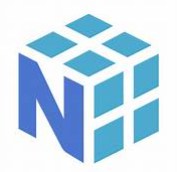
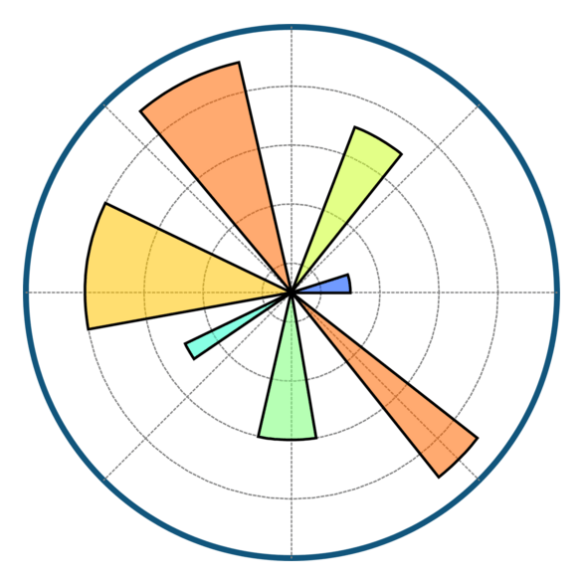
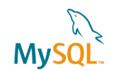

# Hi there! 🙋‍♀️

 

## I'm [**Subala Singh**](https://www.linkedin.com/in/subala-singh-65383b104/) and welcome to my GitHub profile!

I'm a **`Senior Data Analyst`** and an **`Open-source Contributor`**!

### ✨ Fun facts: ✨
- 👩‍💼 Lead data analyst in Voya India.
- 👩🏻‍💻 Before switching to Data Analyst role, I was a SAP ABAP consultant who got a Bachelor's Degree in Electronics and Communication.

### ⚡️ Currently ⚡️
- working as Lead data analyst for Voya India.
- learning Machine learning

### 💡Skills 💡
- Programming languages: Python Libraries (Pandas, NumPy, Matplotlib, seaborn), SQL
- Visualization: Tableau, Microsoft Power BI, Advance Excel, Jupyter Notebook
- Software’s: Snowflake, Salseforce marketing cloud 
- Soft Skills: Good verbal and written communication, Critical thinking, Analytical skills, Ability to work with a multi-cultural & global team environment. 

 ## ⚡ Technologies I use 

<table align="center">
    <tr>
        <td align="center" width="140" height="112.43">
            
              Python
        </td>
        <td align="center" width="140" height="112.43">
            
              Jupyter
        </td>
      <td align="center" width="140" height="112.43">
            
              Numpy
        </td>
      <td align="center" width="140" height="112.43">
            
              Pandas
        </td>
      <td align="center" width="140" height="112.43">
            
              Matplotlib
        </td>
      <td align="center" width="140" height="112.43">
            
              Seaborn
        </td>
        <td align="center" width="140" height="112.43">
            
              TensorFlow
        </td>
        <td align="center" width="140" height="112.43">
            
              Scikit Learn
        </td>
        <td align="center" width="140" height="112.43">
            
              MySQL
        </td>
    </tr>
</table>

### View more repositories 👇
